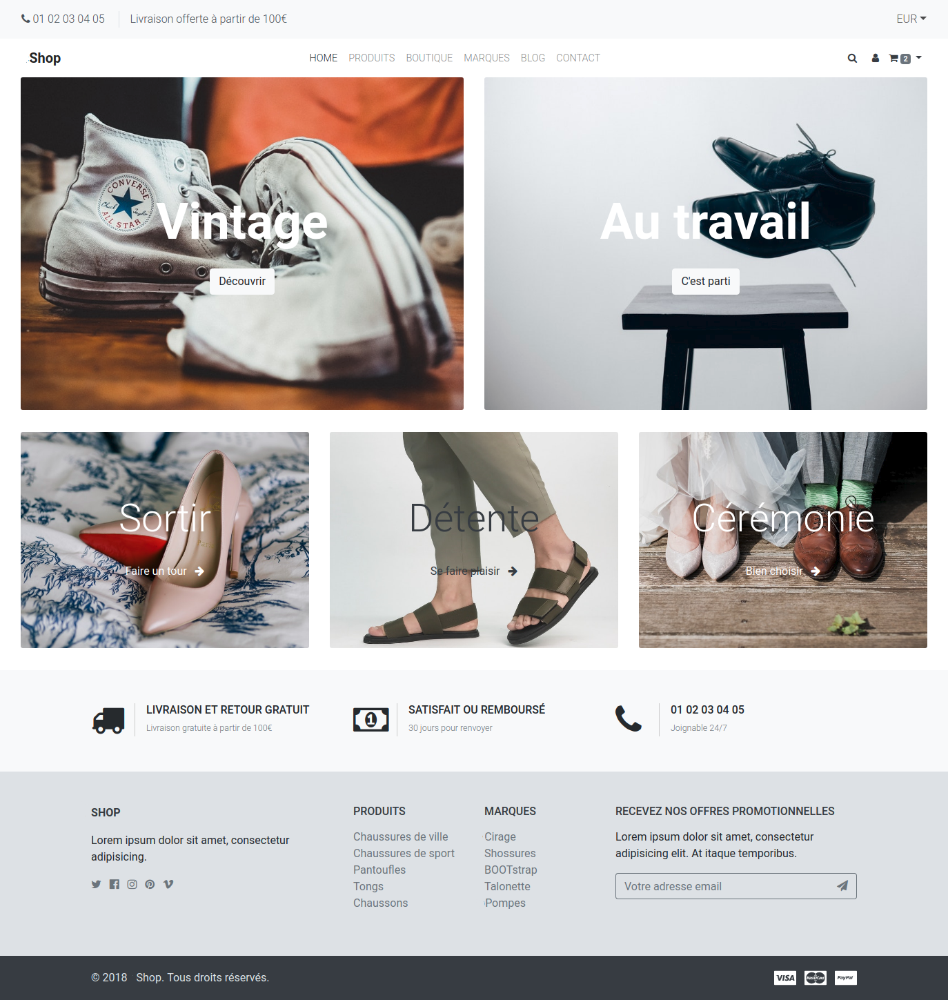
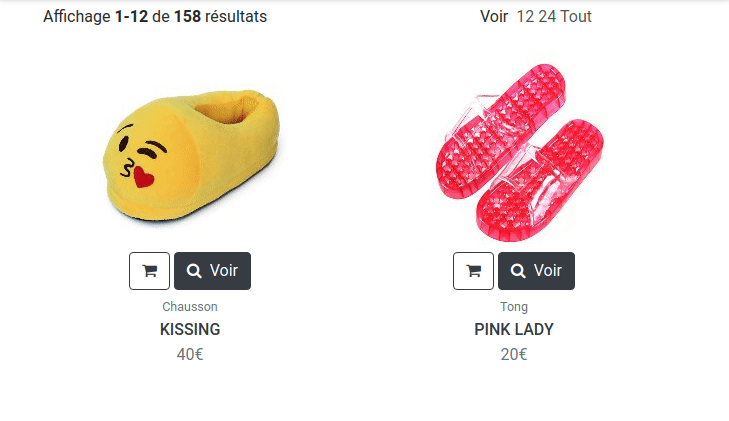
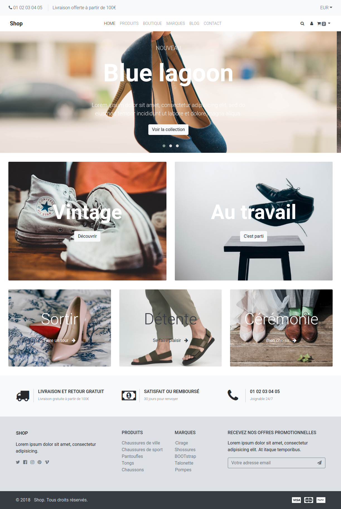

# shop - Dans les shoe

En voila une boutique séduisante :yum:

Oui mais... c'est à vous de l'intégrer :scream:

Pas de panique, un outil est là pour vous y aider. Bootstrap :sunglasses:

Dans le dossier `resultat/` quelques captures sont présentes

## Instructions

### Préambule

- dans le répertoire `html`, vous avez le code source HTML utilisant le framework Bootstrap
  - mise en page simplifiée
  - utilisation de components existants
- cependant, l'intégration HTML/CSS demandée ne correspond pas totalement au visu des sources fournies
  - au cours des étapes qui vont suivre, vous allez devoir "surcharger" Bootstrap dans le fichier `css/styles.css`
  - le code HTML est censé être suffisant en l'état, mais vous pouvez bien entendu le modifier
- chaque étape présente un mélange entre
  - utilisation de l'architecture, l'organisation des fichiers vue en cours
  - intégration HTML/CSS

### HTML/CSS/BOOTSRAP

#### Etape 1 - Layout

- analyser les zones qui se répètent d'une page à l'autre
- commencer par l'intégration HTML/CSS de ces "zones" / ce "gabarit" / ce "layout"
- on laisse le contenu spécifique à chaque page pour plus tard

#### Etape 2 - Templates / Views

- une fois le "layout" mis en place, on va le mettre en place dans notre projet _shop_
- les fichiers CSS, images et JavaScript sont à placer dans le répertoire `public/assets/` (puis un des sous-répertoires)
  - il faudra certainement ensuite modifier les liens (**URLs**) vers ces fichiers
- ensuite, pour le layout, vous aurez besoin de créer les _views_ "header" et "footer" :wink:

#### Etape 3 - Home

- faire l'intégration HTML/CSS de la page d'accueil directement dans le projet

#### Etape 4 - Catégorie

- faire l'intégration HTML/CSS de la page catégorie (liste de produits) directement dans le projet

#### Etape 5 - Cart

- faire l'intégration HTML/CSS de la page panier directement dans le projet

### Bonus

### Bonus Fioritures :lipstick

#### ... fun

et si on animait un peu cette interface. Dans la partie catégorie on pourrait légèrement modifier la présentation de nos produits

#### ... qui pique

Si nous ajoutions un sélecteur de devise et un résumé du panier sur TOUTES les pages de la boutique ?

#### ... de la mort

Pourquoi ne pas ajouter un carousel à cette page d'accueil ?

Cet [outil](https://owlcarousel2.github.io/OwlCarousel2/) semble très adapté :+1:

### PHP

#### Description

Le nom de code du projet est pour l'instant : **shop**.

C'est une boutique en ligne de chaussures.  
Oui, il y a déjà beaucoup de concurrence sur le marché, mais nous sommes un groupement de plusieurs marques de chaussures qui ne sont pas encore présentes sur internet.  Et nous ne souhaitons pas dépendre d'une autre société.

#### MVP

Pour l'instant, nous souhaitons juste tester le marché et donc créer un MVP (minimum viable product) de la boutique.  
Ce MVP contiendra :

- une page d'accueil
- une page des produits pour chaque catégorie
- une page produit
- une page panier

Les produits pourront être ajoutés au panier depuis la liste de produits de la page "catégorie" et depuis la page du produit.  
Un produit est attaché à une seule catégorie.

En bas de chaque page, il y aura :

- le nom de la boutique
- le slogan
- les liens vers les pages de la boutique sur les réseaux sociaux
- 5 types de produits
- 5 marques de produits

Sur la page d'accueil, 5 catégories seront mises en avant.

En bas de page d'accueil, nous souhaitons mettre en avant que la livraison et les retours sont gratuits, que les clients ont 30 jours pour renvoyer leur produit, que les internautes peuvent nous contacter au numéro du service client : 01 02 03 04 05 de 8h à 19h, du lundi au vendredi.

#### V2

Une fois le test terminé, nous souhaitons mettre en place :

- un tunnel de vente :
  - adresse de facturation
  - adresse de livraison
  - choix de la méthode livraison
  - méthode de paiement
  - paiement
  - confirmation de commande
  - annulation de commande
- une interface d'administration :
  - login sécurisé
  - gestion des catégories (ajout, modification, suppression)
  - gestion des produits (ajout, modification, suppression)
  - gestion des commandes (liste + changement du statut payé-envoyé-annulé-retourné)
  - gestion des utilisateurs de l'interface d'administration

En bas de chaque page, il y aura en plus un formulaire d'inscription à la newsletter, qui sera prévu dans la créa **dès la version MVP**.
# projet2

# projet2

# projet2

